# RAFT Toolkit

> **Retrieval Augmentation Fine-Tuning Toolkit**  

## 🚀 Overview

### What is RAFT?

**RAFT (Retrieval Augmentation Fine-Tuning)** is a technique that trains language models to better utilize retrieved documents when answering questions. Unlike traditional RAG systems that rely on frozen pre-trained models, RAFT fine-tunes models specifically for document-based reasoning tasks.

The RAFT Toolkit automates the creation of training datasets by generating `{question, answer, documents}` triplets from your documents, enabling you to fine-tune models that excel at retrieval-augmented generation tasks.

#### RAFT Training Process Flow

```mermaid
graph TD
    A[📄 Input Documents<br/>PDF, TXT, JSON, PPTX] --> B{🔧 RAFT Toolkit<br/>CLI or Web UI}
    
    B --> C[📑 Document Chunking<br/>Semantic/Fixed/Sentence]
    C --> D[❓ Question Generation<br/>LLM-powered Q&A creation]
    D --> E[📝 Answer Generation<br/>Context-based responses]
    E --> F[🎭 Distractor Addition<br/>Irrelevant docs for robustness]
    F --> G[📊 Training Dataset<br/>JSONL/Parquet format]
    
    G --> H[🤖 Model Fine-tuning<br/>OpenAI/HuggingFace/Azure]
    H --> I[🎯 Fine-tuned Model<br/>Domain-optimized LLM]
    
    G --> J{🛠️ Analysis Tools}
    J --> K[📈 Dataset Evaluation<br/>eval.py]
    J --> L[💬 Answer Generation<br/>answer.py]  
    J --> M[🔍 PromptFlow Analysis<br/>pfeval_*.py]
    
    K --> N[📊 Performance Metrics]
    L --> O[🔄 Model Comparison]
    M --> P[📋 Quality Assessment]
    
    N --> Q[✨ Production Model<br/>Optimized for RAG tasks]
    O --> Q
    P --> Q
    
    style B fill:#e1f5fe,color:#000000
    style J fill:#f3e5f5,color:#000000
    style Q fill:#e8f5e8,color:#000000
```



**🔧 Toolkit Components:**
- **Core Engine**: Document processing and dataset generation
- **Analysis Tools**: Six evaluation and comparison utilities  
- **Web Interface**: Visual workflow management and monitoring
- **CLI Tools**: Scriptable automation and batch processing

### RAFT vs Traditional RAG: Key Differences

| Aspect | Traditional RAG | RAFT Fine-Tuning |
|--------|-----------------|-------------------|
| **Model Training** | Uses frozen pre-trained models | Fine-tunes models on domain-specific data |
| **Document Utilization** | May ignore or misuse retrieved documents | Learns to effectively use retrieved information |
| **Performance** | Depends on base model's retrieval reasoning | Optimized for specific document types/domains |
| **Latency** | Requires runtime retrieval + inference | Faster inference with better document integration |
| **Setup Complexity** | Lower initial setup | Higher setup (requires training data generation) |
| **Customization** | Limited to prompt engineering | Deep customization through fine-tuning |

### Advantages of RAFT Fine-Tuning

**✅ Performance Benefits:**
- **Improved Document Reasoning**: Models learn to better understand and utilize retrieved documents
- **Domain Adaptation**: Optimized for specific document types (legal, medical, technical, etc.)
- **Reduced Hallucination**: Better grounding in provided context through training
- **Enhanced Factual Accuracy**: Explicit training on document-based question answering

**✅ Operational Benefits:**
- **Faster Inference**: No need for complex retrieval orchestration at runtime
- **Consistent Quality**: Predictable performance across similar document types
- **Cost Efficiency**: Smaller fine-tuned models can outperform larger general models

### When to Use RAFT vs Traditional RAG

**Use RAFT Fine-Tuning When:**
- You have consistent document types/formats
- Performance on document reasoning is critical
- You can invest time in data generation and training
- You need predictable, high-quality outputs
- Latency optimization is important

**Use Traditional RAG When:**
- Working with diverse, changing document types
- Quick prototyping or proof-of-concept needed
- Limited resources for training data generation
- Documents change frequently
- General-purpose question answering is sufficient

### The RAFT Fine-Tuning Process

#### 1. **Training Data Generation** (This Toolkit)
```bash
# Generate RAFT training dataset
python raft.py --datapath documents/ --output training_data/
```
- **Document Chunking**: Split documents into semantic chunks
- **Question Generation**: Create relevant questions for each chunk  
- **Answer Generation**: Generate accurate answers using the source chunk
- **Distractor Addition**: Include irrelevant documents to improve robustness
- **Format Conversion**: Export in format suitable for fine-tuning platforms

#### Chunking Strategies & Configuration

Effective chunking is critical for RAFT success. Choose your strategy based on document type and use case:

##### **📏 Chunk Size Guidelines**

| **Document Type** | **Recommended Chunk Size** | **Reasoning** |
|------------------|---------------------------|----------------|
| **Technical Documentation** | 300-512 tokens | Preserves complete concepts and code examples |
| **Legal Documents** | 512-768 tokens | Maintains clause/section coherence |
| **Medical Literature** | 256-512 tokens | Balances detail with focused topics |
| **Research Papers** | 512-1024 tokens | Captures complete paragraphs and findings |
| **FAQ/Knowledge Base** | 128-256 tokens | Each chunk = one question/topic |
| **News Articles** | 256-512 tokens | Preserves story coherence |

##### **🔄 Overlap Strategy**

| **Overlap %** | **Use Case** | **Trade-offs** |
|--------------|-------------|----------------|
| **0%** | Distinct topics, FAQ | Clean separation, no redundancy |
| **10-20%** | Technical docs | Minimal context preservation |
| **20-40%** | Narrative content | Good context flow, some redundancy |
| **40-60%** | Complex topics | Maximum context, high redundancy |

```bash
# Low overlap for distinct topics
--chunking-params '{"overlap": 0}'

# Medium overlap for connected content  
--chunking-params '{"overlap": 100}'  # ~20% of 512 tokens

# High overlap for complex documents
--chunking-params '{"overlap": 200}'  # ~40% of 512 tokens
```

##### **❓ Questions Per Chunk**

| **Questions/Chunk** | **Use Case** | **Quality vs Quantity** |
|-------------------|-------------|------------------------|
| **1-2** | High-quality, focused datasets | Maximum quality, minimal redundancy |
| **3-5** | Balanced approach (recommended) | Good quality, reasonable coverage |
| **6-10** | Comprehensive coverage | Risk of lower quality questions |

```bash
# Focused, high-quality
--questions 2 --chunk_size 512

# Balanced approach (recommended)
--questions 5 --chunk_size 384

# Comprehensive coverage
--questions 8 --chunk_size 256
```

##### **🎭 Distractor Configuration**

| **Distractors** | **Training Benefit** | **Dataset Size Impact** |
|----------------|---------------------|------------------------|
| **2-3** | Basic robustness | Moderate increase |
| **4-6** | Strong robustness (recommended) | 5-7x dataset size |
| **7-10** | Maximum robustness | 8-11x dataset size |

```bash
# Recommended configuration
--distractors 4 --questions 5 --chunk_size 512

# Resource-constrained
--distractors 2 --questions 3 --chunk_size 384

# Maximum robustness
--distractors 6 --questions 3 --chunk_size 256
```

##### **⚙️ Strategy-Specific Recommendations**

**🧠 Semantic Chunking** (Recommended)
```bash
--chunking-strategy semantic --chunk_size 512 \
--chunking-params '{"overlap": 50, "min_chunk_size": 200}'
```
- **Best for**: Most document types, preserves meaning
- **Overlap**: 50-100 tokens for context preservation
- **Min size**: 200 tokens to ensure meaningful chunks

**📐 Fixed Chunking**
```bash
--chunking-strategy fixed --chunk_size 384 \
--chunking-params '{"overlap": 75}'
```
- **Best for**: Consistent processing, structured documents
- **Overlap**: 15-25% of chunk size
- **Use when**: Semantic understanding less critical

**📝 Sentence Chunking**
```bash
--chunking-strategy sentence --chunk_size 256 \
--chunking-params '{"overlap": 0}'
```
- **Best for**: Natural language, narrative content
- **Overlap**: Usually 0 (sentence boundaries are natural breaks)
- **Chunk size**: Maximum tokens per chunk (actual size varies)

#### 2. **Model Fine-Tuning**
```bash
# Example with OpenAI fine-tuning
openai api fine_tunes.create \
  -t training_data.jsonl \
  -m gpt-3.5-turbo \
  --suffix "raft-medical-docs"
```
- **Platform Selection**: Choose fine-tuning platform (OpenAI, HuggingFace, etc.)
- **Model Selection**: Start with instruction-tuned base models
- **Training Configuration**: Set learning rate, epochs, batch size
- **Validation**: Monitor training metrics and validation performance

#### 3. **Evaluation & Iteration**
```bash
# Evaluate fine-tuned model
python tools/eval.py --model ft:gpt-3.5-turbo:suffix --question-file eval.jsonl
```
- **Performance Testing**: Compare against baseline models
- **Error Analysis**: Identify common failure patterns
- **Data Augmentation**: Generate additional training examples for weak areas
- **Iterative Improvement**: Refine dataset and retrain

### Best Practices for RAFT Training Data

#### Document Preparation
- **Quality Over Quantity**: Use high-quality, authoritative documents
- **Consistent Format**: Maintain consistent document structure and formatting
- **Domain Relevance**: Focus on documents representative of target use cases
- **Optimal Length**: Use documents of 1,000-10,000 tokens for best chunking results

#### Question Generation
- **Diverse Question Types**: Include factual, analytical, and inferential questions
- **Appropriate Difficulty**: Match question complexity to intended use case
- **Natural Language**: Generate questions that users would realistically ask
- **Coverage**: Ensure questions cover all important document sections

#### Dataset Composition
- **Distractor Ratio**: Use 3-5 distractor documents per training example
- **Oracle Probability**: Include source document 80-100% of the time
- **Balanced Difficulty**: Mix easy, medium, and hard questions
- **Size Guidelines**: Aim for 1,000-10,000 training examples minimum

#### Quality Assurance
- **Manual Review**: Sample and manually verify question-answer pairs
- **Consistency Checks**: Ensure answers are actually derivable from context
- **Bias Detection**: Check for dataset biases and systematic errors
- **Evaluation Split**: Reserve 10-20% of data for evaluation

RAFT takes an input document and creates a dataset of `{question, answer, documents}` triplets for fine-tuning LLMs on retrieval-augmented tasks. Now available with both **CLI** and **Web UI** interfaces plus comprehensive **evaluation tools**!

**Features:**
- 📊 **Dual Interface**: Command-line tool and modern web interface
- 🛠️ **Analysis Tools Suite**: Evaluation, answer generation, and PromptFlow analysis
- 🏗️ **12-Factor Architecture**: Cloud-native, scalable design
- 📄 **Multi-Format Support**: PDF, TXT, JSON, PPTX, and API documentation
- 🎯 **Flexible Output**: HuggingFace, OpenAI completion/chat, and evaluation formats
- ⚡ **Parallel Processing**: Configurable workers for optimal performance
- 🧪 **Comprehensive Testing**: Unit, integration, API, and CLI test suites
- 🐳 **Container Ready**: Docker support for easy deployment

## 📦 Installation

### Prerequisites

- Python 3.9+ (3.11 recommended)
- OpenAI API key (or Azure OpenAI credentials)
- Optional: Docker & Docker Compose for containerized deployment

### 🚀 Quick Start (Recommended)

```bash
# Clone the repository
git clone https://github.com/your-repo/raft-toolkit.git
cd raft-toolkit

# Set up environment
cp .env.example .env
# Edit .env with your OpenAI API key

# Install dependencies
pip install -r requirements.txt

# Test installation
python run_tests.py --unit --fast

# Start web interface
python run_web.py
# Open http://localhost:8000
```

### 🐳 Docker Installation

```bash
# Clone and configure
git clone https://github.com/your-repo/raft-toolkit.git
cd raft-toolkit
cp .env.example .env
# Edit .env with your configuration

# Run with Docker Compose
docker compose up -d

# Access services
# Web interface: http://localhost:8000
# Redis dashboard: http://localhost:8081
```

### 📋 Detailed Installation

#### Core Dependencies
```bash
# Essential packages for basic functionality
pip install -r requirements.txt
```

#### Web Interface (Optional)
```bash
# For full web UI experience
pip install -r requirements-web.txt
```

#### Development & Testing (Optional)
```bash
# For contributors and advanced users
pip install -r requirements-test.txt

# Run full test suite
python run_tests.py --coverage --output-dir ./test-results
```

#### Multi-Target Docker Builds
```bash
# Production deployment
docker build --target production -t raft-toolkit:prod .

# Development with debugging
docker build --target development -t raft-toolkit:dev .

# CLI-only lightweight image
docker build --target cli -t raft-toolkit:cli .

# Testing environment
docker build --target testing -t raft-toolkit:test .
```

### Environment Setup

Create a `.env` file in the project root:

```bash
# OpenAI Configuration
OPENAI_API_KEY=your_openai_api_key_here
OPENAI_API_BASE_URL=https://api.openai.com/v1

# Azure OpenAI Configuration (optional)
AZURE_OPENAI_ENABLED=false
AZURE_OPENAI_ENDPOINT=https://your-resource.openai.azure.com/
AZURE_OPENAI_KEY=your_azure_openai_key
AZURE_OPENAI_API_VERSION=2024-02-01

# Web Interface Configuration
WEB_HOST=0.0.0.0
WEB_PORT=8000
WEB_DEBUG=false

# Evaluation Configuration
EVAL_MODEL=gpt-4
EVAL_WORKERS=4
```

## ⚙️ Main Arguments

- **`--datapath`**: Path to the input document
- **`--output`**: Path to save the generated dataset
- **`--output-format`**: Output format (`hf` [default], `completion`, `chat`)
- **`--output-type`**: Output file type (`jsonl` [default], `parquet`)
- **`--output-chat-system-prompt`**: System prompt for chat output (optional)
- **`--distractors`**: Number of distractor documents per data point
- **`--doctype`**: Document type (`pdf`, `txt`, `json`, `api`, `pptx`)
- **`--p`**: Percentage of including the oracle document in context
- **`--chunk_size`**: Size of each chunk (in tokens)
- **`--questions`**: Number of QA pairs to generate per chunk
- **`--workers`**: Number of workers for QA generation
- **`--embed-workers`**: Number of workers for chunking/embedding
- **`--openai_key`**: OpenAI API key
- **`--embedding-model`**: Embedding model (default: `text-embedding-ada-002`)
- **`--completion-model`**: Model for QA generation (default: `gpt-4`)
- **`--use-azure-identity`**: Use Azure Default Credentials for token retrieval
- **`--chunking-strategy`**: Chunking algorithm (`semantic` [default], `fixed`, `sentence`)
- **`--chunking-params`**: JSON string of extra chunker params (e.g. `'{"overlap": 50, "min_chunk_size": 200}'`)

## 🧪 Testing & Quality Assurance

### Test Runner

The RAFT Toolkit includes a comprehensive test suite with configurable directories:

```bash
# Run all tests
python run_tests.py

# Run specific test types
python run_tests.py --unit              # Unit tests only
python run_tests.py --integration       # Integration tests
python run_tests.py --api              # API tests
python run_tests.py --cli              # CLI tests

# With coverage reporting
python run_tests.py --coverage --output-dir ./test-results

# Fast tests (skip slow ones)
python run_tests.py --fast

# Parallel execution
python run_tests.py --parallel 4
```

### Configurable Test Directories

Configure test directories via CLI arguments or environment variables:

```bash
# Custom directories via CLI
python run_tests.py --integration \
  --output-dir ./ci-results \
  --temp-dir /tmp/fast-ssd \
  --coverage-dir ./coverage

# Via environment variables
export TEST_OUTPUT_DIR=./my-results
export TEST_TEMP_DIR=/tmp/my-temp
export TEST_COVERAGE_DIR=./coverage
python run_tests.py --coverage

# Docker testing with custom directories
export HOST_TEST_RESULTS_DIR=/shared/test-results
docker compose -f docker-compose.test.yml up
```

See [`docs/TEST_DIRECTORIES.md`](docs/TEST_DIRECTORIES.md) for complete configuration guide.

### Docker Testing

```bash
# Run tests in Docker environment
docker compose -f docker-compose.test.yml up --abort-on-container-exit

# Specific test suites
docker compose -f docker-compose.test.yml run raft-test-unit
docker compose -f docker-compose.test.yml run raft-test-integration
```

### Code Quality

```bash
# Install code quality tools
pip install -r requirements-test.txt

# Run linting
flake8 .
black --check .
isort --check-only .
mypy .

# Auto-format code
black .
isort .
```

### Security Scanning

```bash
# Install security tools
pip install bandit safety

# Run security scans
bandit -r . -f json -o security-report.json
safety scan -r requirements.txt
```

## 🚀 CI/CD Integration

### GitHub Actions Workflows

The project includes comprehensive CI/CD pipelines:

**Build Pipeline** (`Build → Test → Release`):
- 🔍 **Code Quality**: Linting with flake8, black, isort
- 🏗️ **Multi-Target Builds**: Production, development, CLI, testing images
- 🔒 **Security Scanning**: Bandit, Safety, Trivy vulnerability scans
- 📦 **Container Registry**: Automatic publishing to GitHub Container Registry

**Test Pipeline**:
- 🧪 **Comprehensive Testing**: Unit, integration, API, CLI, Docker tests
- 📊 **Coverage Reporting**: Codecov integration with detailed metrics
- 🐍 **Multi-Python Support**: Testing on Python 3.9, 3.10, 3.11
- ⚡ **Parallel Execution**: Optimized test execution with dependency management

**Security Pipeline**:
- 🛡️ **Dependency Scanning**: Daily automated vulnerability checks
- 📋 **License Compliance**: Automated license compatibility verification
- 🔄 **Auto-Updates**: Automated dependency update PRs

### Environment Variables for CI/CD

```bash
# Test configuration
TEST_OUTPUT_DIR=/workspace/test-results
TEST_TEMP_DIR=/workspace/temp
TEST_COVERAGE_DIR=/workspace/coverage

# Docker configuration
HOST_TEST_RESULTS_DIR=/tmp/ci-results
HOST_COVERAGE_DIR=/tmp/ci-coverage
HOST_TEMP_DIR=/tmp/ci-temp

# Security scanning
ENABLE_SECURITY_SCANS=true
UPLOAD_SARIF=true
```

### Pipeline Configuration Examples

**GitLab CI**:
```yaml
test:
  script:
    - pip install -r requirements-test.txt
    - python run_tests.py --coverage --output-dir ./test-results
  artifacts:
    reports:
      junit: test-results/junit.xml
      coverage_report:
        coverage_format: cobertura
        path: test-results/coverage.xml
```

**Jenkins**:
```groovy
pipeline {
    agent any
    environment {
        TEST_OUTPUT_DIR = "${WORKSPACE}/test-results"
        TEST_TEMP_DIR = "/tmp/jenkins-${BUILD_ID}"
    }
    stages {
        stage('Test') {
            steps {
                sh 'python run_tests.py --coverage'
                publishTestResults testResultsPattern: 'test-results/junit.xml'
                publishCoverage adapters: [coberturaAdapter('test-results/coverage.xml')]
            }
        }
    }
}
```

## 📝 Azure OpenAI Support

To enable Azure OpenAI support, set the environment variable `AZURE_OPENAI_ENABLED=1` (or `true`).

You must also set the appropriate Azure OpenAI environment variables (e.g., `AZURE_OPENAI_ENDPOINT`, `AZURE_OPENAI_KEY`, etc.) as required by your deployment.

Example for zsh:

```zsh
export AZURE_OPENAI_ENABLED=1
export AZURE_OPENAI_ENDPOINT="https://your-azure-endpoint.openai.azure.com/"
export AZURE_OPENAI_KEY="your-azure-api-key"
```

If `AZURE_OPENAI_ENABLED` is not set or is set to `0`/`false`, the toolkit will use standard OpenAI API endpoints and keys.

## ⚡ Quick Start

### 🖥️ Command Line Interface

```bash
# Set up environment variables
export OPENAI_API_KEY="your_api_key_here"

# Run CLI tool
python raft.py \
  --datapath sample_data/United_States_PDF.pdf \
  --output ./sample_output \
  --distractors 4 \
  --doctype pdf \
  --chunk_size 512 \
  --questions 5

# Preview mode (no processing)
python raft.py --datapath sample.pdf --preview

# Validate configuration only
python raft.py --datapath sample.pdf --validate
```

### 🌐 Web Interface

```bash
# Start the web server
python run_web.py

# Or with custom configuration
python run_web.py --host 0.0.0.0 --port 8080 --debug

# Open http://localhost:8000 in your browser
```

**Web UI Features:**
- 📤 **Dataset Generation**: Drag & drop file upload with visual configuration
- 🛠️ **Analysis Tools**: Six powerful evaluation and analysis tools
- ⚙️ **Visual Configuration**: Interactive forms for all settings
- 👀 **Live Preview**: See processing estimates before running
- 📊 **Job Management**: Track multiple processing jobs with real-time updates
- 📥 **Download Results**: Direct download of generated datasets and analysis results
- 📈 **Results Visualization**: Comprehensive display of metrics and statistics

**Analysis Tools Available:**
- **Dataset Evaluation**: Evaluate model performance with configurable metrics
- **Answer Generation**: Generate high-quality answers using various LLMs
- **PromptFlow Analysis**: Multi-dimensional evaluation (relevance, groundedness, fluency, coherence)
- **Dataset Analysis**: Statistical analysis and quality metrics
- **Model Comparison**: Side-by-side performance comparison
- **Batch Processing**: Automated workflows for multiple datasets

### 🛠️ Standalone Tools (CLI)

The `tools/` directory contains powerful standalone evaluation utilities:

```bash
# Navigate to tools directory
cd tools/

# Install tool dependencies
pip install -r requirements.txt

# Run dataset evaluation
python eval.py --question-file dataset.jsonl --answer-file answers.jsonl

# Generate answers for evaluation
python answer.py --input questions.jsonl --output answers.jsonl --workers 8

# Run PromptFlow evaluation
python pfeval_chat.py --input dataset.jsonl --output evaluation.json
```

See the [tools/README.md](tools/README.md) for comprehensive documentation on all available tools.

## 🧩 Chunking Options

- **Semantic** (default): Embedding-based, best for context preservation.
- **Fixed**: Splits by token count (`--chunk_size`).
- **Sentence**: Splits by sentence boundaries, each chunk ≤ `--chunk_size` tokens.

**Extra parameters for semantic chunking** (via `--chunking-params`):

- `overlap`: Tokens to overlap between chunks (default: 0)
- `min_chunk_size`: Minimum chunk size (default: 0)
- `number_of_chunks`: Override number of chunks (default: auto)

**Example:**

```bash
python3 raft.py --datapath sample_data/United_States_PDF.pdf \
  --output ./sample_ds4 \
  --distractors 4 \
  --doctype pdf \
  --chunk_size 512 \
  --questions 5 \
  --openai_key OPENAI_KEY \
  --chunking-strategy semantic \
  --chunking-params '{"overlap": 50, "min_chunk_size": 200}'
```

## 📝 Workflow

1. **Chunk Generation**: Document is split into chunks (see options above).
2. **QA Generation**: LLM generates N questions and answers per chunk.
3. **Distractor Appending**: Random chunks are added as distractors for each QA pair.
4. **Dataset Export**: Data is saved in the specified format for fine-tuning.

## 💡 Tips

- You can use a `.env` file for OpenAI/Azure keys.
- For Azure, set deployment names with `--completion-model` and `--embedding-model`.
- Use `--chunking-strategy` and `--chunking-params` for best results on your data.

## 📚 File Utilities

- **Split large JSONL files:**

  ```python
  from core.utils.file_utils import split_jsonl_file
  split_jsonl_file('yourfile.jsonl', max_size=50_000_000)
  ```

- **Extract random rows:**

  ```python
  from core.utils.file_utils import extract_random_jsonl_rows
  extract_random_jsonl_rows('yourfile.jsonl', 100, 'sampled_output.jsonl')
  ```

## 🏗️ Architecture

This toolkit follows **12-factor app principles** with a modular architecture:

```
raft-toolkit/
├── core/                    # Shared business logic
│   ├── config.py           # Configuration management
│   ├── models.py           # Data models
│   ├── raft_engine.py      # Main orchestration
│   └── services/           # Business services
├── cli/                    # Command-line interface
├── web/                    # Web interface & API
├── run_cli.py             # CLI entry point
├── run_web.py             # Web entry point
└── docker-compose.yml     # Container orchestration
```

**Benefits:**
- ✅ **Separation of Concerns**: UI and business logic decoupled
- ✅ **Environment Parity**: Same code for dev/prod
- ✅ **Configuration via Environment**: 12-factor compliance
- ✅ **Horizontal Scaling**: Stateless design
- ✅ **Container Ready**: Docker & Kubernetes support

See [ARCHITECTURE.md](ARCHITECTURE.md) for detailed technical documentation.

## 🧪 Testing

The toolkit includes a comprehensive test suite covering unit tests, integration tests, API tests, and CLI tests.

### Run Tests

```bash
# Install test dependencies
pip install -r requirements-test.txt

# Run all tests
python run_tests.py

# Run specific test categories
python run_tests.py --unit           # Unit tests only
python run_tests.py --integration    # Integration tests only
python run_tests.py --api            # API tests only
python run_tests.py --cli            # CLI tests only

# Run with coverage
python run_tests.py --coverage

# Run with verbose output
python run_tests.py --verbose
```

**Test Categories:**
- **Unit Tests**: Core functionality and business logic
- **Integration Tests**: Service interactions and data flow
- **API Tests**: Web interface endpoints and responses
- **CLI Tests**: Command-line interface validation

See [TESTING.md](TESTING.md) for detailed testing documentation.

## 🚀 Deployment

### Local Development

```bash
# Development mode with auto-reload
python run_web.py --debug

# Production mode
python run_web.py --host 0.0.0.0 --port 8000
```

### Docker Deployment

```bash
# Build and run with Docker Compose
docker-compose up -d

# Scale workers
docker-compose up -d --scale worker=3

# View logs
docker-compose logs -f
```

### Cloud Deployment

The toolkit is designed for cloud deployment with:
- **Environment-based configuration**
- **Stateless architecture**
- **Horizontal scaling support**
- **Health check endpoints**

See deployment guides for specific platforms:
- See [DEPLOYMENT.md](docs/DEPLOYMENT.md) for comprehensive deployment guides including AWS, Azure, Google Cloud, and Kubernetes

## 🛠️ Fine-tuning & Evaluation

### Model Fine-tuning

- See [DEPLOYMENT.md](docs/DEPLOYMENT.md) for Azure AI Studio fine-tuning guidance
- Use generated datasets with popular fine-tuning frameworks:
  - HuggingFace Transformers
  - OpenAI Fine-tuning API
  - Azure AI Studio
  - Local training with LoRA/QLoRA

### Comprehensive Evaluation

The toolkit provides multiple evaluation approaches:

**1. Basic Evaluation:**
```bash
python tools/eval.py --question-file YOUR_EVAL_FILE.jsonl --answer-file YOUR_ANSWER_FILE
```

**2. PromptFlow Multi-dimensional Evaluation:**
```bash
# Chat format evaluation
python tools/pfeval_chat.py --input dataset.jsonl --output results.json

# Completion format evaluation  
python tools/pfeval_completion.py --input dataset.jsonl --output results.json

# Local evaluation (no API calls)
python tools/pfeval_local.py --input dataset.jsonl --output results.json --mode local
```

**3. Web Interface Evaluation:**
- Use the Analysis Tools tab in the web interface
- Upload datasets and configure evaluation parameters
- Download comprehensive evaluation reports

**4. Model Comparison:**
```bash
# Generate answers from different models
python tools/answer.py --input questions.jsonl --output gpt4_answers.jsonl --model gpt-4
python tools/answer.py --input questions.jsonl --output gpt35_answers.jsonl --model gpt-3.5-turbo

# Compare results using web interface Model Comparison tool
```

**Evaluation Metrics:**
- **Relevance**: How relevant is the answer to the question?
- **Groundedness**: Is the answer grounded in the provided context?
- **Fluency**: How fluent and natural is the language?
- **Coherence**: How coherent and logical is the response?
- **Similarity**: How similar is the answer to reference answers?

## 🦙 Using Ollama as the OpenAI Model Service

You can use [Ollama](https://ollama.com/) as a local OpenAI-compatible API for running models like Llama 3, Mistral, and others. This allows you to run RAFT without cloud API keys.

**1. Start Ollama with your desired model:**

```bash
ollama run llama3
```

**2. Set the OpenAI-compatible endpoint in your environment:**

```bash
export OPENAI_API_BASE_URL="http://localhost:11434/v1"
export OPENAI_API_KEY="ollama-anything"  # Any non-empty string
```

Or add these to your `.env` file:

```env
OPENAI_API_BASE_URL=http://localhost:11434/v1
OPENAI_API_KEY=ollama-anything
```

**3. Run RAFT as usual:**

```bash
python3 raft.py \
  --datapath sample_data/United_States_PDF.pdf \
  --output ./sample_ds4 \
  --distractors 4 \
  --doctype pdf \
  --chunk_size 512 \
  --questions 5 \
  --openai_key $OPENAI_API_KEY
```

**Note:**

- Ollama's API is compatible with the OpenAI API, but some advanced features may not be supported.
- You can specify different models by running `ollama run <model_name>` and setting the appropriate model in your RAFT command if needed.

## 🏗️ Project Structure

```
raft-toolkit/
├── 📁 core/                      # Core business logic
│   ├── clients/                  # External API clients
│   ├── config.py                 # Configuration management
│   ├── formatters/               # Dataset format converters
│   ├── models.py                 # Data models and schemas
│   ├── raft_engine.py           # Main orchestration engine
│   ├── security.py              # Security utilities
│   └── services/                 # Business services
│       ├── dataset_service.py    # Dataset operations
│       ├── document_service.py   # Document processing
│       └── llm_service.py       # LLM interactions
├── 📁 cli/                       # Command-line interface
│   └── main.py                   # CLI entry point
├── 📁 web/                       # Web interface
│   ├── app.py                    # FastAPI application
│   └── static/                   # Frontend assets
├── 📁 tools/                     # Standalone evaluation tools
│   ├── eval.py                   # Dataset evaluation
│   ├── answer.py                 # Answer generation
│   └── pfeval_*.py              # PromptFlow evaluations
├── 📁 tests/                     # Comprehensive test suite
│   ├── unit/                     # Unit tests
│   ├── integration/              # Integration tests
│   ├── api/                      # API tests
│   └── cli/                      # CLI tests
├── 📁 docs/                      # Documentation
│   ├── WEB_INTERFACE.md          # Web UI guide
│   ├── DEPLOYMENT.md             # Deployment instructions
│   ├── CONFIGURATION.md          # Configuration reference
│   └── TEST_DIRECTORIES.md      # Test configuration guide
├── 📁 .github/                   # CI/CD workflows
│   └── workflows/
│       ├── build.yml             # Build & code quality
│       ├── test.yml              # Comprehensive testing
│       ├── release.yml           # Release automation
│       └── security.yml          # Security scanning
├── 🐳 docker-compose.yml         # Multi-service orchestration
├── 🐳 docker-compose.test.yml    # Testing environment
├── 🐳 Dockerfile                 # Multi-stage container builds
├── 🔧 requirements*.txt          # Python dependencies
├── ⚙️ .env.example              # Environment template
├── ⚙️ .env.test.example         # Test configuration template
├── 🧪 run_tests.py              # Test runner with configurable directories
├── 🌐 run_web.py                # Web server launcher
├── 📋 raft.py                   # Legacy CLI entry point
└── 📖 README.md                 # This documentation
```

## 🚀 Deployment

### 🐳 Docker Deployment

**Production Deployment:**
```bash
# Build production image
docker build --target production -t raft-toolkit:latest .

# Run with environment file
docker run -d \
  --name raft-toolkit \
  --env-file .env \
  -p 8000:8000 \
  -v $(pwd)/data:/app/data \
  -v $(pwd)/outputs:/app/outputs \
  raft-toolkit:latest
```

**Docker Compose (Recommended):**
```bash
# Production stack with Redis and monitoring
docker compose -f docker-compose.yml up -d

# Development with hot reload
docker compose -f docker-compose.dev.yml up -d

# Testing environment
docker compose -f docker-compose.test.yml up
```

### ☁️ Cloud Deployment

**Kubernetes:**
```yaml
apiVersion: apps/v1
kind: Deployment
metadata:
  name: raft-toolkit
spec:
  replicas: 3
  selector:
    matchLabels:
      app: raft-toolkit
  template:
    metadata:
      labels:
        app: raft-toolkit
    spec:
      containers:
      - name: raft-toolkit
        image: ghcr.io/your-org/raft-toolkit:latest
        ports:
        - containerPort: 8000
        env:
        - name: OPENAI_API_KEY
          valueFrom:
            secretKeyRef:
              name: raft-secrets
              key: openai-api-key
        resources:
          requests:
            memory: "512Mi"
            cpu: "500m"
          limits:
            memory: "2Gi"
            cpu: "1000m"
```

**Helm Chart** (Advanced users):
```bash
# Add repository (when available)
helm repo add raft-toolkit https://charts.raft-toolkit.com
helm repo update

# Install with custom values
helm install raft-toolkit raft-toolkit/raft-toolkit \
  --set openai.apiKey="your-api-key" \
  --set scaling.replicas=3 \
  --set persistence.enabled=true
```

### 🔧 Environment Configuration

**Production `.env`:**
```bash
# Core Configuration
OPENAI_API_KEY=your_production_api_key
RAFT_ENV=production
LOG_LEVEL=INFO

# Web Server
WEB_HOST=0.0.0.0
WEB_PORT=8000
WEB_WORKERS=4

# Database
REDIS_URL=redis://redis:6379

# Security
CORS_ORIGINS=https://your-domain.com
ENABLE_AUTH=true
JWT_SECRET=your_jwt_secret

# Monitoring
ENABLE_METRICS=true
METRICS_PORT=9090

# Storage
UPLOAD_PATH=/app/uploads
OUTPUT_PATH=/app/outputs
MAX_FILE_SIZE=100MB
```

### 📊 Monitoring & Observability

**Health Checks:**
```bash
# Application health
curl http://localhost:8000/health

# Detailed metrics
curl http://localhost:8000/metrics

# System status
docker compose exec raft-toolkit python -c "
import sys
from core.config import RaftConfig
config = RaftConfig()
print(f'Status: OK')
print(f'Version: {config.version}')
print(f'Environment: {config.env}')
"
```

**Log Aggregation:**
```yaml
# docker-compose.override.yml
version: '3.8'
services:
  raft-toolkit:
    logging:
      driver: "json-file"
      options:
        max-size: "10m"
        max-file: "3"
        labels: "service=raft-toolkit,environment=production"
```

### 🔒 Security Best Practices

**Container Security:**
```bash
# Run security scan
docker run --rm -v /var/run/docker.sock:/var/run/docker.sock \
  -v $(pwd):/code aquasec/trivy fs /code

# Check for vulnerabilities in image
docker run --rm -v /var/run/docker.sock:/var/run/docker.sock \
  aquasec/trivy image raft-toolkit:latest
```

**Network Security:**
```yaml
# docker-compose.security.yml
version: '3.8'
networks:
  raft-network:
    driver: bridge
    internal: true
  web-network:
    driver: bridge

services:
  raft-toolkit:
    networks:
      - raft-network
      - web-network
    security_opt:
      - no-new-privileges:true
    cap_drop:
      - ALL
    cap_add:
      - NET_BIND_SERVICE
```

## 🤝 Contributing

We welcome contributions! Please see our [Contributing Guide](CONTRIBUTING.md) for details.

**Development Setup:**
```bash
# Clone and setup
git clone https://github.com/your-org/raft-toolkit.git
cd raft-toolkit

# Install development dependencies
pip install -r requirements-test.txt

# Run tests
python run_tests.py --coverage

# Run code quality checks
flake8 .
black --check .
isort --check-only .

# Pre-commit hooks (optional)
pre-commit install
```

## 📄 License

This project is licensed under the [MIT License](https://opensource.org/licenses/MIT).
